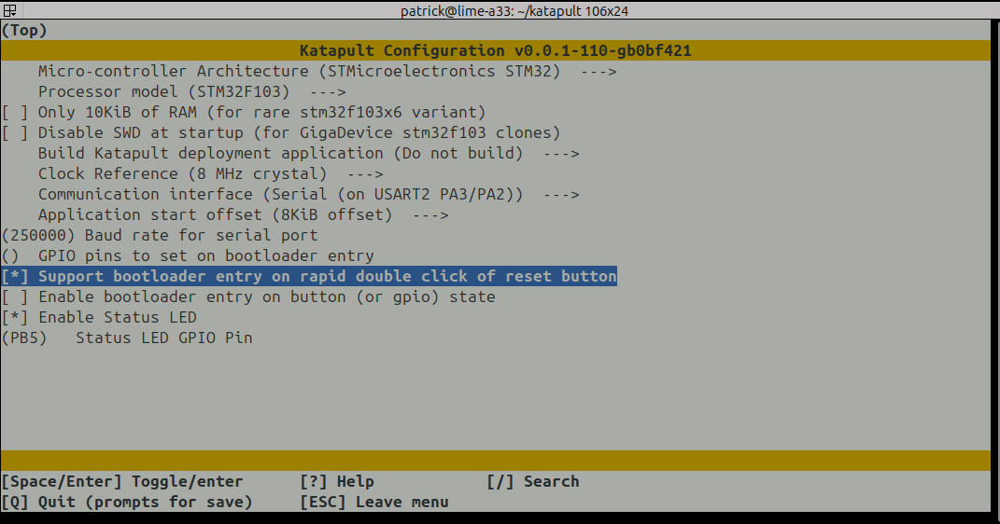
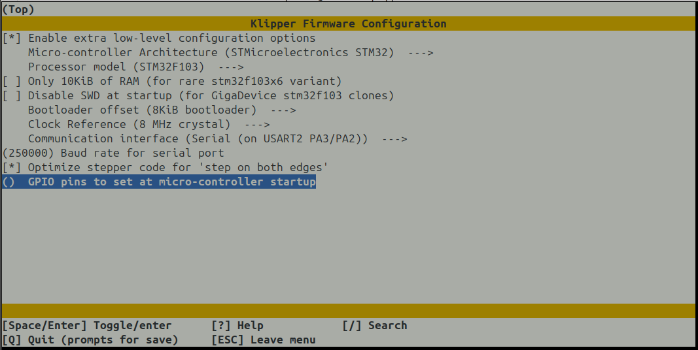

## MCU compilation for the MCU board

The MCU is a STM32F103VC on the M200 and the stepper motor drivers are A4988.
Format LQFP100

STM32F103VC
Flash memory: 256KB
SRAM: 64 KB
Package: LQFP100

### From the Marlin port

```
#
# Zortrax M200/M300 (STM32F103VCT6)
#
[env:STM32F103VC_zortrax_m200]
extends                     = stm32_variant
board                       = genericSTM32F103VC
board_build.variant         = MARLIN_F103Vx
build_flags                 = ${stm32_variant.build_flags} -DDEBUG_LEVEL=0
monitor_speed               = 115200
board_build.offset          = 0x8000       (32768 bytes, 32K offset)
board_upload.offset_address = 0x08008000
```
However, their bootloader is undocumented and the data seems encrypted because firmware.bin does not contian arm code.
It can be replaced by Katapult, using the debug pins.

### Build the firmware

```
./kiauh/kiauh.sh
Select
 4) [Advanced] 
  1) [Build] 
```

And then select (Enable extra low-level configuration options):
Micro-controller Architecture: STM32
Processor model:               STM32F103
Bootloader at:                 8K for katapult, 32K if it was the zortrax bootloader (and it is not).
Communication interface:       USART2 on PA3 PA2
Frequency                      8Mhz

It will build the firmware.

### Configure

The firmware is generic, it needs a configuration file to assign the pins and other stuff.
The configuration can be deduced from the Zortrax Marlin port. See in "pins_ZORTRAX_M200.h".

The other part of the work for the printer configuration has been made by rpanfili in his sk200 retrofit.
He used an sk200 and he changed the stepper motors and mybe the extruder but the other parts are the same.

#### Serial communication

To connect serial user interface (OctoPrint or other using Raspberry PI or UART converter and PC) you can use debug header on the motherboard. You will need to solder connector by yourself.

Pinout of the **DEBUG** header described below:
-	NRST
-	**GND <--- connect to GND on host**
-	TMS/NC SWDIO
-	TCK/NC SWDCLK
-	**TX <--- connect to RX on host**
-	**RX <--- connect to TX on host**
-	BOOT0
-	VCC (marked on mainboard as 3.3V)

**Caution**: if you are going to use debugger (ST-Link), know that any attempt to read or write from/to flash memory will result in mass erase of the flash. It will erase the the bootloader and all the settings, including lifetimer, serial number and hardware version, as flash memory of chip is read out protection enabled at production! If that happens you won't be able to use official firmware anymore!

### Android board P3 Pins

Android side       MCU side

5V                 5V
GND                GND
GPIO               STM
ADOHC              MTS
LED                BOOT
GPIOS              GPIO
RST                RST
SLP
RX                 RX
TX                 TX

      MCU Pins                              Android pins
-------------------------------------------------------------------------------------------------
STM   is PD2 TIM3_ETR/UART5_RX/SDIO_CMD     gpio_pin_5 = port:PC01<1><default><default><0>  MISO
MTS   is PD1 OSC_OUT/FSMC_D3/CAN_TX         gpio_pin_6 = port:PC00<1><default><default><0>  MOSI
BOOT  is PD3 USART2_CTS                     gpio_pin_7 = port:PC02<1><default><default><1>  CLK
GPIO  is PD5 USART2_TX                      gpio_pin_8 = port:PC03<0><1><default><0>        CS
RESET is PD4 USART2_RTS                     gpio_pin_9 = port:PF01<1><default><default><0>  
SLP   is not connected                      gpio_pin_10 = port:PF00<1><default><default><0>
RX    is PA3 USART2_RX                      PB0
TX    is PA2 USART2_TX                      PB1

uart2_cts_rts_pb_pins: uart2-cts-rts-pb-pins {
    pins = "PB2", "PB3";
    function = "uart2";
};

## Debug connector:

RESET; VSS/GND; PA13;     PA14;        PA10;       PA9;      BOOT0; 3.3V
              JTMS-SWDIO  JTCK-SWCLK  USART1_RX  USART1_TX
                                           
                                           STLINK
1 3.3V (square pin)                     1 3.3V (square pin)    X
2 BOOT0                                 2 SWCLK                to 5
3 PA9      USART1_TX                    3 GND                  to 7
4 PA10     USART1_RX                    4 SWDIO                to 6
5 PA14     JTCK-SWCLK                   5 RESET                to 8
6 PA13     JTMS-SWDIO                   6 SWO                  X
7 VSS/GND
8 RESET

### Katapult configuration

Replacing the vendor bootloader with the katapult bootloader using the debug port.

To configure the Katapult bootloader. From the katapult repo: use the following `make menuconfig` options.



In the Katapult repo:
```
make menuconfig

Micro-controller architecture: STM32F13
No deployment application
Clock reference: 8Mhz crystal
Communicaiton iunterface: USART2 PA3/PA2
Application start offset 8KB offset.

make
```

It generates ./out/katapult.bin
That's what we flash as bootloader.
Using the Katapult's flashtool on the debug header. This erases the chip and there is no coming back to the Zortrax firmware and software suite.
The stock MCU is read protected, we must do a mass erase prior to flashing Katapult.
An uart is not enough, we need the SWDIO SWDCLK pins connected to a STLINK V2 system.

```
$ sudo apt update
$ sudo apt install stlink-tools openocd

# Unlock the chip with open ocd
# Start openocd
$ openocd -f interface/stlink.cfg -f target/stm32f1x.cfg

# In another console:
$ telnet localhost 4444
Trying 127.0.0.1...
Connected to localhost.
Escape character is '^]'.
Open On-Chip Debugger
> reset halt
[stm32f1x.cpu] halted due to debug-request, current mode: Thread 
xPSR: 0x01000000 pc: 0xfffffffe msp: 0xfffffffc
> stm32f1x unlock 0
device id = 0x10036414
STM32 flash size failed, probe inaccurate - assuming 512k flash
flash size = 512 KiB
stm32x unlocked.
INFO: a reset or power cycle is required for the new settings to take effect.

> shutdown
shutdown command invoked
Connection closed by foreign host.
```
Then reset the chip and use st-flash to finish the job.
```
$ st-info --probe

Found 1 stlink programmers
  version:    V2J16
  serial:     303030303030303030303031
  flash:      262144 (pagesize: 2048)
  sram:       65536
  chipid:     0x414
  dev-type:   F1xx_HD


$ st-flash erase
st-flash 1.8.0
2026-01-23T23:15:39 INFO common.c: F1xx_HD: 64 KiB SRAM, 24544 KiB flash in at least 2 KiB pages.
Mass erasing...
Mass erase completed successfully.

$ st-flash write ./out/katapult.bin 0x8000000

st-flash 1.8.0
2026-01-23T23:28:59 INFO common.c: F1xx_HD: 64 KiB SRAM, 256 KiB flash in at least 2 KiB pages.
file ./out/katapult.bin md5 checksum: 3f9582c8e129668f7be5ef1487634c7, stlink checksum: 0x0004b37d
2026-01-23T23:28:59 INFO common_flash.c: Attempting to write 3348 (0xd14) bytes to stm32 address: 134217728 (0x8000000)
-> Flash page at 0x8000800 erased (size: 0x800)
2026-01-23T23:28:59 INFO flash_loader.c: Starting Flash write for VL/F0/F3/F1_XL
2026-01-23T23:28:59 INFO flash_loader.c: Successfully loaded flash loader in sram
2026-01-23T23:28:59 INFO flash_loader.c: Clear DFSR
2026-01-23T23:28:59 INFO flash_loader.c: Clear CFSR
2026-01-23T23:28:59 INFO flash_loader.c: Clear HFSR
  2/2   pages written
2026-01-23T23:28:59 INFO common_flash.c: Starting verification of write complete
2026-01-23T23:28:59 INFO common_flash.c: Flash written and verified! jolly good!
```

STM32Programmer can also be used to the same goal.

### Flashing the klipper software

Now from the single board computer.

To configure the Klipper firmware, you can use the following `make menuconfig` options from the klipper repo. Refer to the image below for guidance:



Make sure to select the appropriate options for your setup.
```
make menuconfig
make

~$ sudo apt update
~$ sudo apt install python3-serial
~$ sudo service klipper stop
# Reset the device with the debug port
~$ sudo python3 ./katapult/scripts/flashtool.py -d /dev/ttyS2 -b 250000 -f ./klipper/out/klipper.bin
Connecting to Serial Device /dev/ttyS2, baud 250000
Detected Klipper binary version v0.13.0-464-g48f0b3ca, MCU: stm32f103xe
Attempting to connect to bootloader
Katapult Connected
Software Version: v0.0.1-110-gb0bf421
Protocol Version: 1.1.0
Block Size: 64 bytes
Application Start: 0x8002000
MCU type: stm32f103xe
Flashing '/home/patrick/klipper/out/klipper.bin'...

[##################################################]

Write complete: 19 pages
Verifying (block count = 581)...

[##################################################]

Verification Complete: SHA = 937D058BE91B1866070F106B6476898C47725810
Programming Complete
```

### Update the firmware using the bootloader

Once klipper installed with the STM32 programmer, we can update the firmware using the serial port.
If fuser of the Klipper serial port returns something, then stop the Klipper service.
```
fuser /dev/ttyS2
/dev/ttyS2:            946
sudo service klipper stop
# Reset the mcu board using the debug port
sudo python3 ./katapult/scripts/flashtool.py -d /dev/ttyS2 -b 250000 -f ./klipper/out/klipper.bin
sudo service klipper start
```
